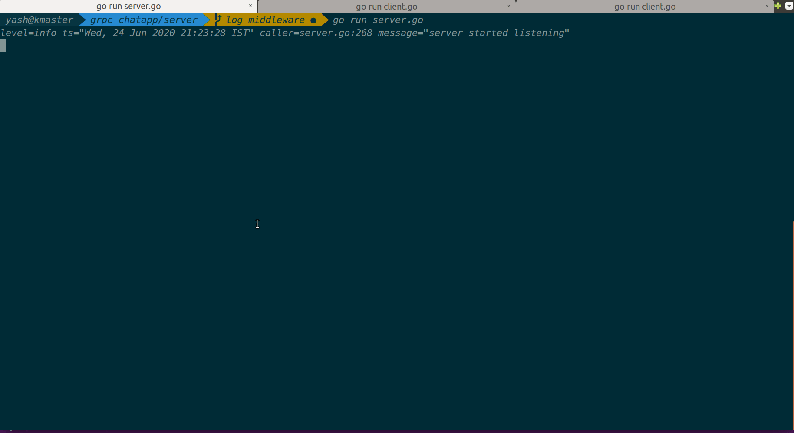
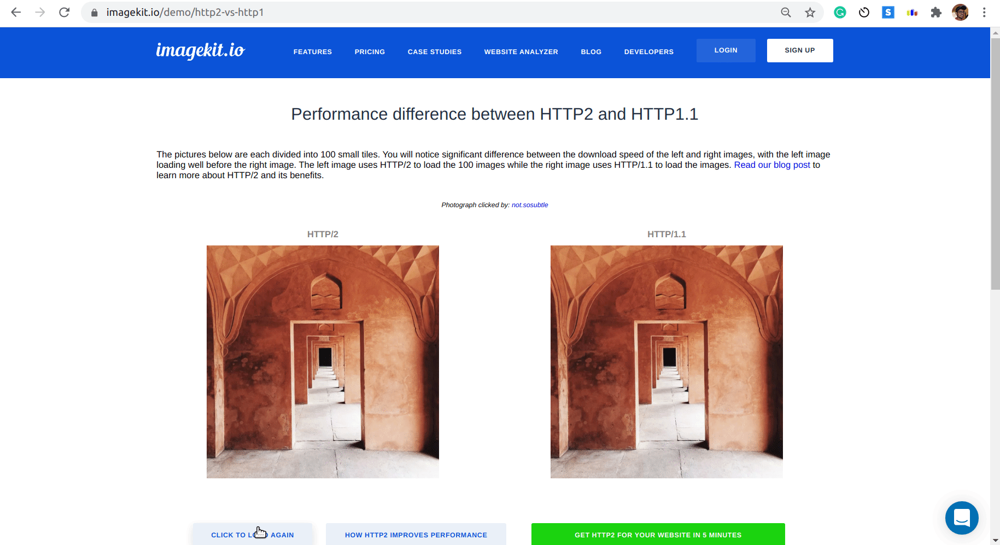

# GRPC-Chat-App
gRPC based terminal-2-terminal based chat app

# GRPC Chat Application

* This application is an implementation of a client-server connection using [**grpc remote protocol**](https://grpc.io/) connection
* Unlike HTTP, GRPC provides a bi-directional connection so that both client and server can **stream data** once connected.
* GRPC uses **HTTP2** internally for blazing fast connectivity, speeding connection **200 - 500%**

##
* Server is a **bidi streaming** implementation, while client connects through with the server and subscribes to all the chat messages of other clients, including itself :D.

##
# Support
If there are any issues with the application, please create [an issue](https://github.com/yashrsharma44/grpc-chat-app/issues/new). 
_Open Source Project made with love by Yash Sharma [`@yashrsharma44`](https://github.com/yashrsharma44)._

