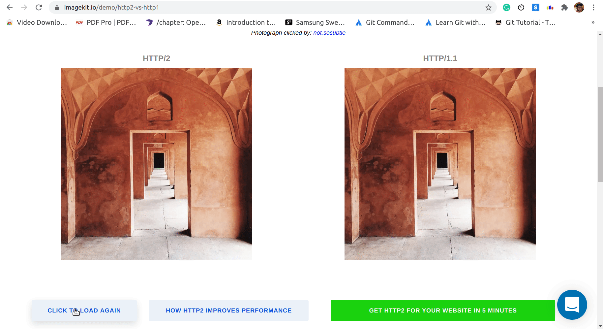

# GRPC-Chat-App
gRPC based terminal-2-terminal based chat app

# GRPC Chat Application

* This application is an implementation of a client-server connection using grpc remote protocol connection
* Unlike HTTP, GRPC provides a bi-directional connection so that both client and server can stream data once connected.
* Server is a bidi streaming implementation, while client connects through with the server and subscribes to all the chat messages of other clients, including itself :D.

* GRPC uses HTTP2 internally for blazing fast connectivity, speeding connection 200 - 500%

