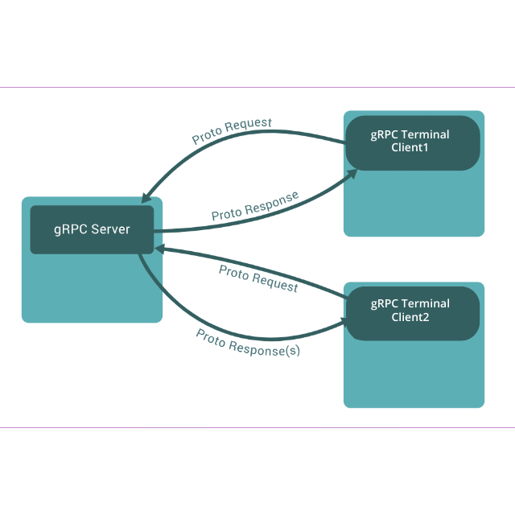

# gRPC-Chat-App
gRPC based terminal-2-terminal based chat app


## gRPC Chat Application

* This application is an implementation of a client-server connection using [**gRPC remote protocol**](https://grpc.io/) connection
* Unlike HTTP, gRPC provides a bi-directional connection so that both client and server can **stream data** once connected.
* gRPC uses **HTTP2** internally for blazing fast connectivity, speeding connection **200 - 500%**


* Server is a **bidi streaming** implementation, while client connects through with the server and subscribes to all the chat messages of other clients, including itself :D.



## Installing it in your system

- Make sure you have go installed in your machine. You can check that using

```bash
$ go version
```
If not installed go to [Go install docs](https://golang.org/doc/install)

- Else, Clone this repo

```bash
$ git clone https://github.com/yashrsharma44/grpc-chat-app.git
```

- To start the server change the directory to `grpc-chatapp/server/` and run

```bash
$ cd grpc-chatapp/server/
$ make run
```
It will install the missing dependencies, build the binary and run the executable. 

- To do the same with the client, change the directory to `grpc-chatapp/client/` and run the previous command. 

```bash
$ cd grpc-chatapp/client/
$ make run
```

- To get more info about the make command, run `make help`. It will display:

```

Choose a command run in server:

  install   Install missing dependencies. Runs `go get` internally.
  build     Building the binary.
  run       Build and run the binary
  exec      Run given command, wrapped with custom GOPATH.
  clean     Clean build files. Runs `go clean` internally.
```

## Support
If there are any issues with the application, please create [an issue](https://github.com/yashrsharma44/grpc-chat-app/issues/new).<br>
_Open Source Project made with love by Yash Sharma [`@yashrsharma44`](https://github.com/yashrsharma44)._
